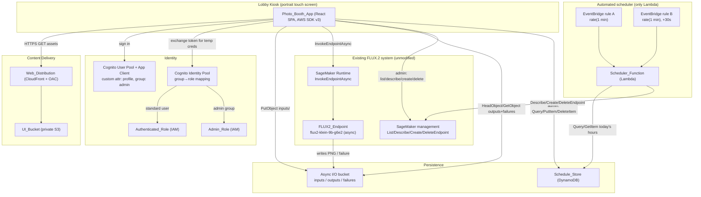
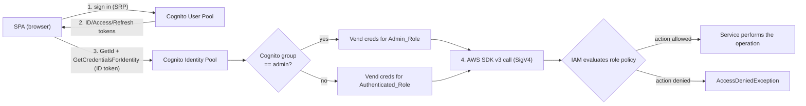
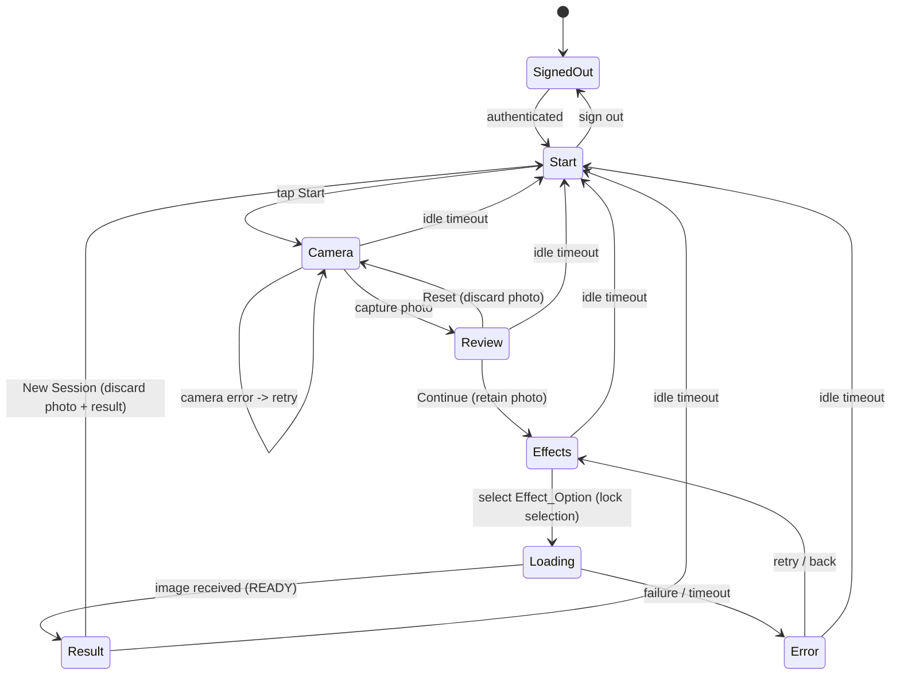
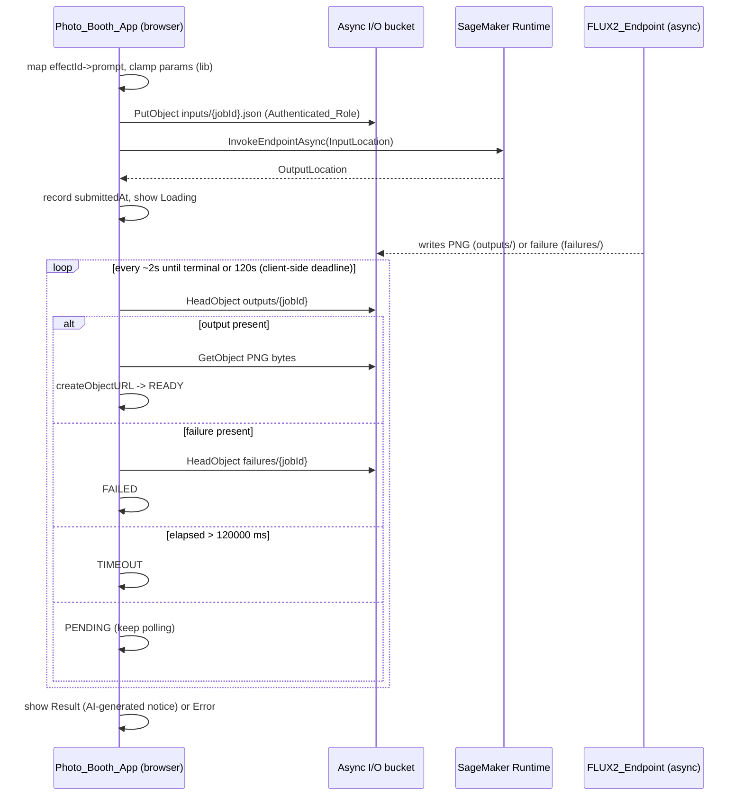
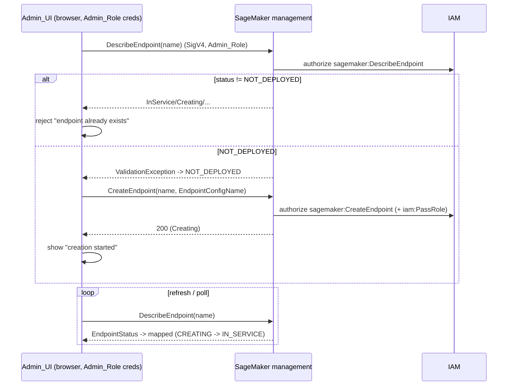

# Design Document: AI Photo Booth

## Overview

The AI Photo Booth is a portrait-oriented kiosk web application for an office lobby. A visitor signs in, captures a webcam photo, picks one of twelve predefined effects (six background replacements, six person transformations), and receives an AI-transformed image. Each effect maps to a prompt; the prompt plus the captured photo (as a base64 reference image) are submitted to the **existing** FLUX.2 [klein] 9B SageMaker **asynchronous** endpoint (`flux2-klein-9b-g6e2`), and the resulting PNG is shown to the visitor.

There is **no per-request backend API**. The React single-page application (SPA) calls AWS services **directly from the browser** using the AWS SDK for JavaScript v3 and **temporary AWS credentials** vended by an Amazon Cognito **identity pool**. Authorization is enforced by **AWS IAM** at the service layer: standard signed-in users assume an `Authenticated_Role`; administrators (members of a Cognito `admin` group) assume an `Admin_Role`. The SPA reads the `profile` claim only to decide whether to *show* the Admin tab — a cosmetic toggle that grants no real privilege, because IAM independently allows or denies every AWS call.

The whole app is gated behind Amazon Cognito. Users whose `profile` custom attribute equals `ADMIN` see an Admin tab for managing the SageMaker endpoint (list, status, start/stop) and a calendar for defining endpoint working hours stored in DynamoDB. A single AWS Lambda — the `Scheduler_Function` — runs on a recurring cadence to start/stop the endpoint automatically according to those working hours; it is the only server-side compute in the system.

All infrastructure is provisioned with AWS CDK in this repository, alongside the existing deployment notebook and inference container code, which are **not** modified by this feature.

### Key design facts (grounded in the existing system)

These were confirmed by reading `code/inference.py`, `flux2-klein-sagemaker.ipynb`, and `README.md` in this repository:

| Fact | Value | Source |
|---|---|---|
| Endpoint name | `flux2-klein-9b-g6e2` | requirements / notebook |
| Invocation style | **Asynchronous** — `sagemaker-runtime:InvokeEndpointAsync` | notebook §5 |
| Request transport | Upload JSON to S3 input prefix, pass `InputLocation` | notebook `invoke()` |
| Input prefix | `s3://{bucket}/flux2-klein-inputs/` | notebook `invoke()` |
| Output prefix | `s3://{bucket}/flux2-klein-outputs/` | `AsyncInferenceConfig.output_path` |
| Failure prefix | `s3://{bucket}/flux2-klein-failures/` | `AsyncInferenceConfig.failure_path` |
| Notifications | SNS `SuccessTopic` + `ErrorTopic` | `AsyncInferenceConfig.notification_config` |
| Concurrency | `max_concurrent_invocations_per_instance=1` | notebook deploy |
| Instance | `ml.g6e.2xlarge` (L40S 48 GB) | notebook deploy |
| Latency | ~7–12 s/request (CPU offload) | README, notebook |
| Response | `image/png` bytes at the `OutputLocation` | `inference.py:output_fn` |

Request JSON schema accepted by `predict_fn`:

| Field | Type | Default | Server behavior |
|---|---|---|---|
| `inputs` | string (also `prompt`) | required | Prompt text; raises if missing/empty |
| `images` | list of base64 PNG/JPEG | `[]` | Reference images; **max 4** |
| `num_inference_steps` | int | `4` | Clamped to `[1, 20]` |
| `guidance_scale` | float | `1.0` | Clamped to `[0, 10]` |
| `height` / `width` | int | `1024` (t2i) / from reference (edit) | Snapped to multiples of 16 |
| `seed` | int | random | Optional |

Because the endpoint derives output dimensions from the first reference image when editing, the photo booth (which always sends the captured photo as a reference) does not need to send `height`/`width`.

### Design decisions at a glance

| Decision | Choice | Rationale |
|---|---|---|
| API layer | **None** — no API Gateway, no per-request Lambdas | The browser calls AWS services directly; removes a whole tier to build, deploy, and secure for a single-kiosk workload |
| AWS access from the browser | **AWS SDK for JavaScript v3** with temporary credentials from a Cognito **Identity Pool** | Standard pattern for SPA-direct-to-AWS; no custom token-exchange code |
| Authorization | **IAM roles** (`Authenticated_Role` / `Admin_Role`) mapped from Cognito groups via the Identity Pool | The AWS service layer enforces least privilege; UI tab hiding is cosmetic only |
| SPA→result delivery | Browser **reads the PNG bytes from S3** (`GetObject`) and renders via a **blob/object URL** | The browser has S3 read credentials; no backend presigned URL needed |
| Async completion detection | Browser **polls the S3 output/failure objects directly** (`HeadObject`/`GetObject`) | No backend to poll on the SPA's behalf; SNS-driven detection remains an optional future optimization |
| Generation timeout | **Enforced client-side** at 120 s from submission | No backend timer; the SPA owns the deadline |
| Admin gating | **IAM at the service layer**; SPA hides the Admin tab from the `profile` claim only | Even if a non-admin reaches an admin code path, IAM denies the call under `Authenticated_Role` |
| Working hours | Stored in DynamoDB; **automated** start/stop via the `Scheduler_Function` Lambda | Requirement intent is cost control; a clear automated mechanism is specified |
| Scheduler compute | A **single Lambda** triggered by **two EventBridge rules** offset ~30 s | EventBridge's minimum granularity is 1 minute; two offset rules approximate a 30 s cadence |
| Removal policy | `DESTROY` (DELETE) on **all** resources | Clean teardown of an ephemeral demo/kiosk stack; its data is transient |
| IaC | AWS CDK (TypeScript) | Matches "all infrastructure via CDK"; TS aligns with the React toolchain |

> **Security tradeoff (accepted):** Vending real AWS credentials to the browser means the kiosk's signed-in principals can call SageMaker Runtime, S3, SageMaker management, and DynamoDB *directly*, bounded only by the IAM role policies. A motivated user with browser dev tools could exercise any action the role allows. This is acceptable for a **single-kiosk lobby demo** behind Cognito sign-in, where the roles are tightly scoped (least privilege, single endpoint, single bucket prefix set, single table) and all resources carry a DELETE removal policy. It would **not** be acceptable for a multi-tenant production system, which would reintroduce a server-side authorization tier.

> **Removal policy (CDK):** Every resource provisioned by this stack (Cognito user pool, Identity Pool, the two IAM roles, DynamoDB `Schedule_Store`, `UI_Bucket`, any async I/O bucket created by this stack, CloudFront distribution, the `Scheduler_Function` Lambda, and the two EventBridge rules) is configured with `RemovalPolicy.DESTROY` so the demo/kiosk stack tears down cleanly. For S3 buckets that must be emptied before deletion (`UI_Bucket`, and any async I/O bucket created by this stack), set `autoDeleteObjects: true`. This matches Requirement 22.4. The pre-existing FLUX.2 weights/inputs/outputs buckets and the existing `flux2-klein-9b-g6e2` SageMaker endpoint are **not** created by this stack and are therefore unaffected by its removal policy.

## Architecture

### System context



The browser is the only client. It talks to S3, SageMaker Runtime, SageMaker management, and DynamoDB directly, signed with Identity-Pool temporary credentials. No request transits an API Gateway or a per-request Lambda. The single `Scheduler_Function` Lambda runs out-of-band on a timer.

### Authorization flow (IAM at the service layer)



Authentication is performed by the Cognito user pool. The Identity Pool maps the `admin` group to `Admin_Role` and all other authenticated identities to `Authenticated_Role`, then vends short-lived STS credentials for the mapped role. Every subsequent AWS call is SigV4-signed with those credentials; **IAM is the sole authority** on whether a call succeeds. A `Standard_User` that somehow invokes an admin operation receives `AccessDeniedException` from the targeted service because the `Authenticated_Role` policy omits that permission (Requirement 14.6). The SPA's reading of the `profile` claim to show/hide the Admin tab is cosmetic and confers no privilege (Requirement 14.1–14.3).

### Project layout

All new artifacts live under the repository root next to the existing files. The existing `flux2-klein-sagemaker.ipynb`, `prepare_weights.py`, `README.md`, and `code/` are untouched.

```
FLUX2-Klein-sagemaker/
├── flux2-klein-sagemaker.ipynb     # EXISTING — untouched
├── prepare_weights.py              # EXISTING — untouched
├── README.md                       # EXISTING — untouched
├── code/                           # EXISTING SageMaker container source — untouched
│   ├── inference.py
│   └── requirements.txt
│
├── cdk/                            # NEW — AWS CDK app (TypeScript)
│   ├── bin/app.ts
│   ├── lib/
│   │   ├── photo-booth-stack.ts    # root stack wiring all constructs
│   │   ├── auth-construct.ts       # Cognito user pool + app client + Identity Pool
│   │   │                           #   + Authenticated_Role + Admin_Role + group→role mapping
│   │   ├── hosting-construct.ts    # UI_Bucket + CloudFront (OAC) + SPA fallback
│   │   ├── data-construct.ts       # Schedule_Store (DynamoDB) + async I/O bucket (or refs)
│   │   │                           #   + the IAM policy statements attached to the two roles
│   │   ├── scheduler-construct.ts  # Scheduler_Function Lambda + two EventBridge rules + its role
│   │   └── initial-users-cr.ts     # custom resource creating initial admin + standard users
│   ├── cdk.json
│   ├── package.json
│   └── tsconfig.json
│
├── backend/                        # NEW — shared pure logic + the ONLY Lambda (TS, Node 20)
│   ├── src/
│   │   ├── scheduler/
│   │   │   └── apply.ts            # EventBridge target: reconcile endpoint vs Working_Hours
│   │   ├── lib/                    # SHARED PURE LOGIC (property-tested; reused by ui/ too)
│   │   │   ├── effects.ts          # Effect_Option catalog + prompt mapping
│   │   │   ├── request-builder.ts  # build Async_Request, clamp params
│   │   │   ├── status-map.ts       # SageMaker status -> EndpointStatus enum + action guards
│   │   │   ├── working-hours.ts    # validation + DDB item (de)serialization + isWithinWindow
│   │   │   ├── poll-decision.ts    # output/failure/timeout/pending decision (pure)
│   │   │   └── authz.ts            # isAdmin(claims) — used client-side to toggle the Admin tab
│   │   └── lib/__tests__/          # unit + property-based tests (fast-check)
│   ├── package.json
│   └── tsconfig.json
│
└── ui/                             # NEW — React SPA (Vite + TypeScript)
    ├── public/
    ├── src/
    │   ├── main.tsx
    │   ├── App.tsx                 # routing + auth gate + admin tab gate (cosmetic)
    │   ├── auth/
    │   │   ├── authService.ts      # getSession / refreshSession / getCredentials /
    │   │   │                       #   refreshCredentials (silent token + STS refresh)
    │   │   └── useAuth.ts          # isAuthenticated / isAdmin / connectionStatus
    │   ├── api/
    │   │   ├── awsClients.ts       # SDK v3 clients built with the refreshing creds provider
    │   │   ├── generation.ts       # submit (PutObject + InvokeEndpointAsync) + poll S3 directly
    │   │   ├── endpoints.ts        # SageMaker management (list/describe/create/delete)
    │   │   └── schedule.ts         # DynamoDB Query/PutItem/DeleteItem
    │   ├── booth/
    │   │   ├── machine.ts          # capture-flow state machine (pure; shares lib types)
    │   │   ├── StartScreen.tsx
    │   │   ├── CameraView.tsx      # getUserMedia + canvas capture
    │   │   ├── ReviewScreen.tsx    # reset / continue
    │   │   ├── EffectSelector.tsx  # 12 options
    │   │   ├── LoadingScreen.tsx
    │   │   └── ResultScreen.tsx    # AI-generated notice + restart
    │   ├── admin/
    │   │   ├── AdminTab.tsx
    │   │   ├── EndpointPanel.tsx
    │   │   └── ScheduleCalendar.tsx
    │   └── theme/                  # portrait layout, 44x44 touch targets
    ├── index.html
    ├── package.json
    └── vite.config.ts
```

The pure-logic modules in `backend/src/lib/` are imported by both the `Scheduler_Function` (in `backend/`) and the SPA (in `ui/`), so the effect catalog, request builder, status map/guards, working-hours logic, poll decision, and `isAdmin` predicate have a single source of truth and a single property-test suite.

### Technology choices and rationale

- **React + Vite + TypeScript (SPA):** Fast static build, deployable to S3/CloudFront; TS gives shared types between `ui/` and `backend/src/lib`.
- **`amazon-cognito-identity-js` for auth:** Drives SRP sign-in, exposes `getSession()` with implicit token refresh, and surfaces ID-token claims (`profile`, `cognito:groups`) for the cosmetic Admin-tab toggle.
- **`@aws-sdk/credential-providers` (`fromCognitoIdentityPool`) + a refreshing wrapper:** Exchanges the Cognito ID token for STS credentials scoped to the mapped IAM role, and lazily re-mints them on expiry.
- **AWS SDK for JavaScript v3 clients in the browser:** `@aws-sdk/client-s3`, `@aws-sdk/client-sagemaker-runtime`, `@aws-sdk/client-sagemaker`, and `@aws-sdk/client-dynamodb` (+ `lib-dynamodb`) call AWS directly under the vended credentials.
- **Blob/object URLs for results:** The browser downloads result PNG bytes with `GetObject` and renders them via `URL.createObjectURL(blob)`, revoking the URL on cleanup. No backend presigned URL is involved.
- **DynamoDB for Schedule_Store:** Trivially cheap, serverless; single-table per-day key design fits the working-hours model.
- **A single Lambda (`Scheduler_Function`) + two EventBridge rules:** The only server-side compute, used purely for automated cost-control start/stop on a ~30 s cadence.

## Components and Interfaces

### Photo_Booth_App (React SPA)

Responsibilities: authentication gate, capture-flow state machine, effect selection, async submission + polling directly against AWS, loading/result UX, admin-tab gating (cosmetic), portrait/touch layout.

The capture flow is modeled as an explicit finite state machine (pure module `booth/machine.ts`) so transitions are testable independent of React:



Notes:
- **Idle auto-reset:** an inactivity timer (configurable, e.g. 60 s) returns the app to `Start` from any visitor-facing state, discarding the captured photo and any result (Requirement 10.4, 10.5).
- **Selection lock:** once an Effect_Option is chosen and submission begins (`Loading`), further selections are ignored until processing completes (Requirement 6.6).
- **Loading/result mutual exclusion:** the renderer derives a single active screen from the machine state; `Loading` and `Result` are distinct states, so they are never shown together (Requirement 9.3).
- **Terminal poll statuses:** `READY | FAILED | TIMEOUT | PENDING` only — there is no content-moderation/`BLOCKED` path.

Key client modules:

| Module | Responsibility |
|---|---|
| `Capture_Module` (`CameraView.tsx`) | `getUserMedia` live feed, canvas capture to base64 PNG/JPEG, camera-error + retry, "temporarily unavailable" message |
| `Effect_Selector` (`EffectSelector.tsx`) | Render all 12 options, record selection, lock during processing |
| `api/awsClients.ts` | Construct SDK v3 clients with the refreshing Identity-Pool credentials provider |
| `api/generation.ts` | `Generation_Service`: submit (PutObject + InvokeEndpointAsync) and poll S3 directly |
| `api/endpoints.ts` | `Endpoint_Manager` endpoint ops via SageMaker management APIs |
| `api/schedule.ts` | `Endpoint_Manager` schedule CRUD via DynamoDB |
| `auth/useAuth` | Sign in/out, expose `isAuthenticated`, `isAdmin` (from `profile` claim, cosmetic), `connectionStatus` |

### Client auth and credentials layer (`ui/src/auth`)

This layer adapts the project's UI best-practices for **silent token refresh** and **silent STS-credential refresh**. There are two independent things that expire — the Cognito **token** and the Identity-Pool **STS credentials** — and each has its own refresh path.

**`authService` contract:**

| Method | Behavior |
|---|---|
| `getSession()` | Returns the current Cognito session, **implicitly refreshing** the access/ID token if it has expired. Returns `null` when the refresh token is dead (the user must sign in again). |
| `refreshSession()` | **Forces** a Cognito token refresh using the stored refresh token, even if the access token still looks valid. Used by reactive retry paths. |
| `getCredentials(session)` | Obtains Identity-Pool (STS) temporary AWS credentials for the session's mapped IAM role. |
| `refreshCredentials()` | **Forces** a re-mint of the Identity-Pool STS credentials (distinct from the Cognito token refresh). |

**The refreshing credentials provider (AWS SDK v3 pattern):** `awsClients.ts` builds each SDK v3 client with a credentials **provider function** that lazily returns valid credentials and re-mints them on expiry, so callers never pass static keys:

```typescript
import { fromCognitoIdentityPool } from "@aws-sdk/credential-providers";
import type { AwsCredentialIdentityProvider } from "@aws-sdk/types";

// Lazy provider: the SDK calls this when it needs creds; it refreshes
// the Cognito session first, then mints Identity-Pool STS creds.
export const credentialsProvider: AwsCredentialIdentityProvider = async () => {
  const session = await authService.getSession();          // implicit token refresh
  if (!session) throw new Error("NotAuthorized");          // refresh token dead -> sign in
  return authService.getCredentials(session);              // STS creds for the mapped role
};
```

**Every AWS SDK call path follows a refresh-once-then-retry rule.** A small wrapper runs the SDK command; on an **auth-flavoured failure** it refreshes once and retries; a second failure means the refresh token is dead and the SPA shows the sign-in interface:

```typescript
async function withAuthRetry<T>(run: () => Promise<T>): Promise<T> {
  try {
    return await run();
  } catch (err) {
    if (!isAuthError(err)) throw err;        // throttling/5xx/network -> do NOT retry here
    await authService.refreshSession();      // force Cognito refresh
    await authService.refreshCredentials();  // force STS re-mint
    try {
      return await run();                    // retry exactly once
    } catch (err2) {
      if (isAuthError(err2)) authService.requireSignIn(); // refresh token dead
      throw err2;
    }
  }
}
```

**`isAuthError` heuristic** (lenient, matches the auth-flavoured families): the error's `name`/`message`/`Code` contains any of `ExpiredToken`, `ExpiredTokenException`, `security token ... expired` (e.g. "The security token included in the request is expired"), `InvalidClientTokenId`, `NotAuthorized`, or maps to a 401/403-style status. It explicitly returns **false** for throttling (`ThrottlingException`, `TooManyRequestsException`), 5xx, and network/abort errors so those are not retried by this path.

**Connection status:** `useAuth` exposes `connectionStatus` with exactly two values — `"connected"` when a valid Cognito session and valid STS credentials are held, otherwise `"disconnected"` (Requirement 13.1–13.3). The UI **never** displays the username or any identity (Requirement 13.4); only the two-state indicator is shown.

### Generation_Service (`ui/src/api/generation.ts`, client-side)

A browser module (not a Lambda) that submits and polls entirely with the visitor's `Authenticated_Role` (or `Admin_Role`) credentials.

**Submit:**
1. Validate `{ effectId: string, photo: string /* base64 */ }`.
2. Resolve `effectId` → prompt via `lib/effects.ts` (reject unknown effect).
3. Build `Async_Request` via `lib/request-builder.ts`: `inputs` = mapped prompt, `images` = `[photo]`, `num_inference_steps` ∈ [4,20], `guidance_scale` ∈ [1,10].
4. `PutObject` the request JSON to `s3://{ioBucket}/flux2-klein-inputs/{jobId}.json` (S3 client).
5. `InvokeEndpointAsync(EndpointName='flux2-klein-9b-g6e2', InputLocation=...)` (SageMaker Runtime client); capture the returned `OutputLocation`.
6. Return `{ jobId, submittedAt }`. The `jobId` deterministically maps to the expected output and failure keys (`flux2-klein-outputs/{jobId}.out`, `flux2-klein-failures/{jobId}.out`).

**Poll** (every ~2 s until terminal or the 120 s client-side deadline), using the pure `lib/poll-decision.ts` to decide from three observations — output present, failure present, elapsed ms:
1. `HeadObject` the output key; if present → `GetObject` the PNG bytes, build a blob/object URL, return `{ status: "READY", imageUrl, aiGenerated: true }`.
2. Else `HeadObject` the failure key; if present → `{ status: "FAILED" }`.
3. Else if `now - submittedAt > 120000 ms` → `{ status: "TIMEOUT" }` (timeout enforced client-side, Requirement 8.5).
4. Else `{ status: "PENDING" }`.

The SPA stops polling on any terminal status and renders the result via the object URL, revoking it when leaving the result screen.

Interface contract (illustrative TypeScript):

```typescript
interface SubmitRequest { effectId: string; photo: string; } // photo: base64 PNG/JPEG
interface SubmitResult { jobId: string; submittedAt: number; }

type PollStatus = "PENDING" | "READY" | "FAILED" | "TIMEOUT";
type PollResult =
  | { status: "PENDING" }
  | { status: "READY"; imageUrl: string; aiGenerated: true } // imageUrl = object URL
  | { status: "FAILED"; reason?: string }
  | { status: "TIMEOUT" };
```

> **Note:** Because the browser holds S3 read credentials, the result PNG is fetched directly with `GetObject` and shown via `URL.createObjectURL`. There is no backend, and therefore no backend-issued presigned URL, anywhere in this flow.

### Async generation sequence (visitor)



### Endpoint_Manager (`ui/src/api/endpoints.ts` + `ui/src/api/schedule.ts`, client-side)

Browser modules that call SageMaker management and DynamoDB **directly under the `Admin_Role`** (vended only to admins by the Identity Pool). There is no server-side admin tier; IAM is the enforcement point.

| UI action | Module | AWS call |
|---|---|---|
| List endpoints | `endpoints.ts` | `ListEndpoints` |
| Current status | `endpoints.ts` | `DescribeEndpoint` (maps `ValidationException`/not found → `NOT_DEPLOYED`) |
| Start (create) | `endpoints.ts` | `DescribeEndpoint` (guard) → `CreateEndpoint` |
| Stop (delete) | `endpoints.ts` | `DescribeEndpoint` (guard) → `DeleteEndpoint` |
| List Working_Hours | `schedule.ts` | DynamoDB `Query` |
| Upsert Working_Hours | `schedule.ts` | DynamoDB `PutItem` |
| Remove Working_Hours | `schedule.ts` | DynamoDB `DeleteItem` |

Status mapping (`lib/status-map.ts`) collapses SageMaker's `EndpointStatus` and the "does not exist" case into the requirement's enumerated set:

| Source condition | Mapped `EndpointStatus` |
|---|---|
| `DescribeEndpoint` → `ValidationException` / not found | `NOT_DEPLOYED` |
| `Creating`, `Updating`, `SystemUpdating` | `CREATING` |
| `InService` | `IN_SERVICE` |
| `Deleting` | `DELETING` |
| `Failed`, `RollbackFailed`, `OutOfService` | `FAILED` |

Start guard (Requirement 17.3): if status is anything other than `NOT_DEPLOYED`, reject with "endpoint already exists". Stop guard (Requirement 18.4): if status is `NOT_DEPLOYED`, return "no endpoint to delete". List error handling (Requirement 15.4): an invalid-credentials/region error is surfaced as a **configuration error distinct from an empty-list result**; an empty list yields a "no endpoints available" message (Requirement 15.5). Stop requires explicit UI confirmation before `DeleteEndpoint` (Requirement 18.2).

The endpoint configuration name to create from is provided to the SPA via build/runtime config (the existing `flux2-klein-9b-g6e2` config), so "start" recreates the booth's endpoint from a known-good config. `CreateEndpoint` may require the SageMaker execution role; if so, the role used must be allowed to `iam:PassRole` it (see IAM policies below).

### Endpoint lifecycle sequence (admin)



If a `Standard_User` (holding `Authenticated_Role` creds) reaches any of these calls, IAM denies them with `AccessDeniedException` because the role lacks SageMaker management permissions (Requirement 14.6).

### Auth_Service (Cognito) and IAM roles

- **User pool** with a custom attribute `custom:profile` (string); a value of `ADMIN` designates an administrator. A Cognito **group `admin`** is the signal the Identity Pool uses for role mapping; the initial admin user is placed in this group and has `custom:profile=ADMIN`.
- **App client** (public SPA client, no secret) with SRP auth.
- **Identity Pool** with authenticated identities only. Role mapping:
  - Members of the `admin` group → **`Admin_Role`**.
  - All other authenticated users → **`Authenticated_Role`** (the pool's default authenticated role).
- The SPA reads `profile` (and/or `cognito:groups`) from the ID token to show/hide the Admin tab (Requirement 14.1–14.3). This is cosmetic; the credentials the pool vends already determine what AWS will allow.

**`Authenticated_Role` — least-privilege policy (capture/effect flow only):**

| Effect | Actions | Resource |
|---|---|---|
| Allow | `sagemaker:InvokeEndpointAsync` | the `FLUX2_Endpoint` ARN (`endpoint/flux2-klein-9b-g6e2`) |
| Allow | `s3:PutObject` | `{ioBucket}/flux2-klein-inputs/*` |
| Allow | `s3:GetObject` | `{ioBucket}/flux2-klein-outputs/*`, `{ioBucket}/flux2-klein-failures/*` |
| Allow | `s3:ListBucket` (enables `HeadObject` 404 vs 403 semantics) | `{ioBucket}`, with a prefix condition limiting to the outputs + failures prefixes |

No Rekognition. No SageMaker management. No DynamoDB. No write access to the outputs/failures prefixes.

**`Admin_Role` — everything in `Authenticated_Role` PLUS endpoint management and schedule writes:**

| Effect | Actions | Resource |
|---|---|---|
| Allow | (all `Authenticated_Role` statements above) | (as above) |
| Allow | `sagemaker:ListEndpoints` | `*` (List has no per-endpoint resource scoping) |
| Allow | `sagemaker:DescribeEndpoint`, `sagemaker:CreateEndpoint`, `sagemaker:DeleteEndpoint` | the `FLUX2_Endpoint` ARN (and its `endpoint-config/*` as needed) |
| Allow | `iam:PassRole` | the SageMaker **execution role** ARN, conditioned on `iam:PassedToService = sagemaker.amazonaws.com` — **required if `CreateEndpoint` passes an execution role** |
| Allow | `dynamodb:Query`, `dynamodb:PutItem`, `dynamodb:DeleteItem` | the `Schedule_Store` table ARN |

> **Note on `iam:PassRole`:** `CreateEndpoint` itself does not take a role, but creating the endpoint *configuration*/model does. If the admin flow ever (re)creates the endpoint config or model rather than reusing the existing `flux2-klein-9b-g6e2` config, the `Admin_Role` must be allowed `iam:PassRole` on the SageMaker execution role. Since "start" reuses the existing config by name, `PassRole` is typically not exercised at `CreateEndpoint` time; it is documented here and granted defensively, scoped to the single execution role.

### Schedule_Calendar + schedule CRUD (`ui/src/api/schedule.ts`)

The calendar renders selectable days, visually marks days that have Working_Hours, and opens a per-day editor. Saving validates `endTime > startTime` client-side using `lib/working-hours.ts` (Requirement 20.2) before any `PutItem`. The calendar reflects "which days have hours" by reading all schedule items on open via DynamoDB `Query` (Requirement 20.5). Removing a day's hours issues `DeleteItem` and clears the indicator (Requirement 20.4). All of these calls run under the `Admin_Role`; a `Standard_User` cannot perform them because the `Authenticated_Role` lacks DynamoDB permissions (Requirement 14.5–14.6).

### Scheduler_Function (the only Lambda)

A Node 20 Lambda whose source is `backend/src/scheduler/apply.ts`. It is the system's only server-side compute and exists purely for automated cost-control start/stop.

**Trigger — approximating a 30 s cadence with EventBridge:** EventBridge's minimum schedule granularity is **1 minute**, so a single rule cannot fire every 30 s. The design uses **two EventBridge rules, each `rate(1 minute)`, offset by ~30 s** so the function effectively runs about twice a minute (Requirement 21.1):
- **Rule A** targets the function directly (fires at ~:00 of each minute relative to its creation).
- **Rule B** also fires every minute but is offset by ~30 s. The offset is realized by one of two documented techniques:
  1. **Two-rules-offset (preferred):** create both rules `rate(1 minute)`; because EventBridge anchors each rule's cadence to its own enable time, staggering their creation/enable yields an approximate 30 s phase difference. This is best-effort and may drift.
  2. **Self-delay target:** Rule B's target invokes the function with an input flag (e.g. `{ "delaySeconds": 30 }`); the handler `await`s ~30 s before reconciling. This guarantees the offset at the cost of a short idle wait inside the invocation.

  The design documents both; the construct picks one and records it in code comments. Either way the reconcile logic below is identical and idempotent, so an imperfect offset only affects latency-to-reconcile, never correctness.

**On each tick the handler:**
1. Reads **today's** Working_Hours for the managed endpoint from `Schedule_Store` (DynamoDB `Query`/`GetItem`).
2. Computes whether "now" (in the configured kiosk timezone) is within `[startTime, endTime)` using `lib/working-hours.ts` `isWithinWindow`.
3. `DescribeEndpoint` to get the actual state, mapped via `lib/status-map.ts`.
4. **Reconciles idempotently:**
   - inside the window AND status `NOT_DEPLOYED` → `CreateEndpoint` (Requirement 21.3);
   - outside the window AND status `IN_SERVICE` → `DeleteEndpoint` (Requirement 21.4);
   - otherwise (desired == actual, or a transitional state) → **do nothing** (Requirement 21.5).

Because it acts only when desired ≠ actual, transient errors self-heal on the next tick, and manual admin start/stop is simply reconciled back toward the schedule. It reuses the same `lib/status-map.ts` guards and `lib/working-hours.ts` window logic as the SPA, so behavior is identical across the two callers.

**`Scheduler_Function` IAM permissions (Requirement 21.6):**

| Effect | Actions | Resource |
|---|---|---|
| Allow | `sagemaker:ListEndpoints` | `*` |
| Allow | `sagemaker:DescribeEndpoint`, `sagemaker:CreateEndpoint`, `sagemaker:DeleteEndpoint` | the `FLUX2_Endpoint` ARN (+ `endpoint-config/*` as needed) |
| Allow | `iam:PassRole` | the SageMaker execution role ARN (conditioned on `iam:PassedToService = sagemaker.amazonaws.com`) — for `CreateEndpoint` |
| Allow | `dynamodb:Query`, `dynamodb:GetItem` | the `Schedule_Store` table ARN (read-only; the scheduler never writes the schedule) |
| Allow | `logs:CreateLogGroup`, `logs:CreateLogStream`, `logs:PutLogEvents` | its CloudWatch Logs log group |

> The timezone is a stack parameter (default `America/Los_Angeles`); times in items are wall-clock local times.

## Data Models

### Effect_Option catalog (`backend/src/lib/effects.ts`, shared with UI types)

```typescript
type EffectCategory = "background" | "person";

interface EffectOption {
  id: string;            // stable key, e.g. "bg_spaceship"
  category: EffectCategory;
  label: string;         // touch-control label
  prompt: string;        // mapped prompt string -> Async_Request.inputs
}
```

The catalog contains exactly 6 background and 6 person options (Requirements 5 and 6). Example prompt mappings (the captured photo is always supplied as the reference image, so prompts are written as edit instructions):

```typescript
export const EFFECTS: EffectOption[] = [
  // --- Background (6) ---
  { id: "bg_spaceship", category: "background", label: "Spaceship interior",
    prompt: "Replace the background behind the person with the interior of a futuristic spaceship: sleek metal corridors, glowing control panels, soft blue lighting. Keep the person's face, pose, and clothing unchanged. Photorealistic." },
  { id: "bg_colosseum", category: "background", label: "Roman colosseum",
    prompt: "Replace the background behind the person with the interior of the ancient Roman Colosseum under a dramatic sky. Keep the person unchanged. Photorealistic, cinematic lighting." },
  { id: "bg_tropical", category: "background", label: "Tropical background",
    prompt: "Replace the background behind the person with a sunlit tropical beach: palm trees, turquoise water, white sand. Keep the person unchanged. Photorealistic." },
  { id: "bg_snowy_peak", category: "background", label: "Snowy mountain peak",
    prompt: "Replace the background behind the person with a snowy mountain summit under crisp blue sky, distant peaks and drifting snow. Keep the person unchanged. Photorealistic." },
  { id: "bg_neon_city", category: "background", label: "Neon city street at night",
    prompt: "Replace the background behind the person with a neon-lit city street at night, rain-slick pavement reflecting pink and blue signage. Keep the person unchanged. Cinematic, photorealistic." },
  { id: "bg_enchanted_forest", category: "background", label: "Enchanted forest",
    prompt: "Replace the background behind the person with an enchanted forest: glowing fireflies, mossy ancient trees, shafts of magical light. Keep the person unchanged. Photorealistic, fantasy." },

  // --- Person (6) ---
  { id: "person_viking", category: "person", label: "Viking warrior",
    prompt: "Transform the person into a Viking warrior: braided hair, fur cloak, leather and iron armor, war paint. Preserve the person's facial identity and pose. Photorealistic." },
  { id: "person_roman_emperor", category: "person", label: "Roman emperor",
    prompt: "Transform the person into a Roman emperor: laurel wreath, white and gold toga, regal bearing. Preserve the person's facial identity and pose. Photorealistic." },
  { id: "person_astronaut", category: "person", label: "Astronaut",
    prompt: "Transform the person into an astronaut wearing a detailed white spacesuit with open helmet. Preserve the person's facial identity and pose. Photorealistic." },
  { id: "person_renaissance", category: "person", label: "Renaissance noble",
    prompt: "Transform the person into a Renaissance noble: rich velvet doublet, lace collar, period styling as in an oil painting. Preserve the person's facial identity and pose." },
  { id: "person_cyberpunk", category: "person", label: "Cyberpunk hacker",
    prompt: "Transform the person into a cyberpunk hacker: neon-accented jacket, augmented-reality visor, glowing tattoos. Preserve the person's facial identity and pose. Photorealistic." },
  { id: "person_knight", category: "person", label: "Medieval knight",
    prompt: "Transform the person into a medieval knight in polished plate armor with a surcoat. Preserve the person's facial identity and pose. Photorealistic." },
];
```

### Async_Request (`backend/src/lib/request-builder.ts`)

```typescript
interface AsyncRequest {
  inputs: string;              // mapped prompt
  images: string[];            // [capturedPhotoBase64], length 1..4
  num_inference_steps: number; // clamped to [4, 20]
  guidance_scale: number;      // clamped to [1, 10]
  seed?: number;               // optional
}

// Booth defaults; clamped to the booth's [4,20] / [1,10] ranges,
// which are a strict subset of the endpoint's [1,20] / [0,10].
const DEFAULTS = { num_inference_steps: 6, guidance_scale: 2.5 };
```

`request-builder` clamps `num_inference_steps` into `[4,20]` and `guidance_scale` into `[1,10]` (Requirement 7.4), sets `inputs` to the mapped prompt (7.2), and places the captured photo in `images` (7.3). This module is imported by `ui/src/api/generation.ts` so the browser builds the request with the same shared, property-tested logic.

### Poll decision (`backend/src/lib/poll-decision.ts`)

Pure function used by `ui/src/api/generation.ts` to decide a poll outcome from three observations, with strict precedence:

```typescript
type PollStatus = "READY" | "FAILED" | "TIMEOUT" | "PENDING";

function decidePoll(input: {
  outputPresent: boolean;
  failurePresent: boolean;
  elapsedMs: number;          // now - submittedAt
  timeoutMs: number;          // 120000
}): PollStatus {
  if (input.outputPresent) return "READY";
  if (input.failurePresent) return "FAILED";
  if (input.elapsedMs > input.timeoutMs) return "TIMEOUT";
  return "PENDING";
}
```

There is no `BLOCKED` status — output presence directly yields `READY` (the SPA then reads the PNG bytes and renders them with an AI-generated notice).

### Schedule_Store (DynamoDB) data model

Single table, on-demand billing. One item per endpoint per day with defined Working_Hours.

| Attribute | Role | Example |
|---|---|---|
| `pk` (partition key) | `ENDPOINT#{endpointName}` | `ENDPOINT#flux2-klein-9b-g6e2` |
| `sk` (sort key) | `DAY#{YYYY-MM-DD}` | `DAY#2025-06-14` |
| `day` | ISO date string | `2025-06-14` |
| `startTime` | `HH:mm` (24h) | `09:00` |
| `endTime` | `HH:mm` (24h), strictly after `startTime` | `17:30` |
| `updatedBy` | admin username | `alice` |
| `updatedAt` | ISO timestamp | `2025-06-01T12:00:00Z` |

Design rationale:
- Partition by endpoint lets a single `Query(pk = ENDPOINT#name)` return the whole schedule for the calendar (Requirement 20.5), and naturally supports multiple managed endpoints later.
- Sort key `DAY#date` makes per-day upsert/delete O(1) (`PutItem`/`DeleteItem`) and keeps days ordered.
- Absence of an item means "no Working_Hours for that day"; the calendar marks a day only when its item exists (Requirements 19.2, 20.3, 20.4).
- The SPA (under `Admin_Role`) performs `Query`/`PutItem`/`DeleteItem`; the `Scheduler_Function` performs read-only `Query`/`GetItem`.

```typescript
interface WorkingHoursItem {
  pk: string;        // ENDPOINT#<name>
  sk: string;        // DAY#<YYYY-MM-DD>
  day: string;       // YYYY-MM-DD
  startTime: string; // HH:mm
  endTime: string;   // HH:mm, must satisfy endTime > startTime
  updatedBy: string;
  updatedAt: string;
}
```

### Working hours → automated start/stop (decision)

**Decision: Working_Hours drive automated start/stop, not merely advisory display.**

Mechanism: the `Scheduler_Function` (triggered by the two offset EventBridge rules described above) reconciles the managed endpoint against today's Working_Hours on each ~30 s tick:
1. Reads today's Working_Hours item for the managed endpoint from `Schedule_Store`.
2. Computes whether "now" (in the configured kiosk timezone) is within `[startTime, endTime)` via `lib/working-hours.ts`.
3. Reconciles desired vs actual endpoint state (mapped via `lib/status-map.ts`): inside the window and `NOT_DEPLOYED` → `CreateEndpoint`; outside the window and `IN_SERVICE` → `DeleteEndpoint`; otherwise no action.

This is idempotent (it only acts when desired ≠ actual) and reuses the same status guards as the admin SPA. Manual admin start/stop remains available and simply changes actual state; the next reconcile respects the schedule. This realizes the cost-control intent behind Requirement 21.

### EndpointStatus enum (shared)

```typescript
type EndpointStatus =
  | "NOT_DEPLOYED"
  | "CREATING"
  | "IN_SERVICE"
  | "DELETING"
  | "FAILED";
```

### Auth claims model

```typescript
interface AuthClaims {
  sub: string;
  username: string;
  "custom:profile"?: string;   // "ADMIN" for administrators
  "cognito:groups"?: string[]; // includes "admin" for administrators
}
// isAdmin(claims) === claims["custom:profile"] === "ADMIN"
//                   || (claims["cognito:groups"] ?? []).includes("admin")
```

`isAdmin` (`lib/authz.ts`) is used **client-side** by the SPA to decide whether to render the Admin tab. It is deliberately not the security boundary — that is the Identity-Pool role mapping plus the IAM policies. It is still worth implementing and property-testing because a wrong toggle would show a broken (IAM-denied) tab to a standard user or hide it from an admin.

## Correctness Properties

*A property is a characteristic or behavior that should hold true across all valid executions of a system — essentially, a formal statement about what the system should do. Properties serve as the bridge between human-readable specifications and machine-verifiable correctness guarantees.*

These properties apply to this feature's **pure logic layer**, which lives in `backend/src/lib` and is imported by both the `Scheduler_Function` and the SPA: the effect catalog, the Async_Request builder (including parameter clamping), the async poll-decision function, the capture-flow state machine, the SageMaker status mapper, the endpoint start/stop guards, the admin authorization predicate, and Working_Hours validation/serialization. The I/O and infrastructure layers (S3, SageMaker Runtime, SageMaker management, DynamoDB, Cognito/Identity-Pool, IAM, CloudFront/CDK) are validated with integration, example, smoke, and snapshot tests instead — see Testing Strategy.

The following properties were derived from the prework analysis and consolidated to remove redundancy (e.g. the six catalog-shape criteria collapse into one property; the poll/await/failure/timeout criteria collapse into one poll-decision property). The reconciliation logic of the `Scheduler_Function` (Requirement 21.3–21.5) is validated through the Working_Hours window logic (Property 12/13) and the status-map guards (Properties 9, 10) it reuses, plus integration tests of the handler.

### Property 1: Effect catalog shape and total prompt mapping

*For all* entries in the effect catalog, there are exactly 12 options split into exactly 6 `background` and 6 `person` options, every option id is unique, and every option has a non-empty `label` and a non-empty `prompt` (so the prompt mapping is total over all options).

**Validates: Requirements 5.1, 5.4, 5.6, 6.1, 6.4, 7.1**

### Property 2: Async_Request maps the selected prompt and embeds the photo

*For all* valid effect ids and *for any* captured-photo base64 string, the request built by `request-builder` has `inputs` equal to the prompt mapped to that effect and has `images` equal to exactly `[photo]` (length 1, within the endpoint's max of 4).

**Validates: Requirements 7.2, 7.3**

### Property 3: Inference parameters are clamped into the booth ranges

*For any* numeric `num_inference_steps` and `guidance_scale` inputs (including out-of-range, negative, zero, or very large values), the built Async_Request has `num_inference_steps` within the inclusive range [4, 20] and `guidance_scale` within the inclusive range [1, 10], and any in-range input is preserved unchanged.

**Validates: Requirements 7.4**

### Property 4: Async poll decision honors precedence (output, failure, timeout, pending)

*For any* combination of (output-object-present, failure-object-present, elapsed-milliseconds), the poll-decision function returns: `READY` when the output object is present; otherwise `FAILED` when the failure object is present; otherwise `TIMEOUT` when elapsed exceeds 120000 ms; otherwise `PENDING`.

**Validates: Requirements 8.2, 8.4, 8.5**

### Property 5: Applying a poll result transitions Loading deterministically and never shows both loading and result

*For any* `Loading` state and *for any* terminal poll result, applying a `READY` result yields `Result` carrying the image, applying `FAILED` or `TIMEOUT` yields `Error` carrying no image, and applying `PENDING` keeps `Loading`; and for every reachable machine state exactly one screen is active, so `Loading` and `Result` are never simultaneously active.

**Validates: Requirements 9.2, 9.3, 9.4**

### Property 6: Effect selection records the choice, enters Loading, and locks out further selections

*For any* `Effects` state and *for any* valid effect id, dispatching `SELECT(id)` transitions to `Loading` with the selected effect recorded; and *for any* sequence of subsequent `SELECT` events while in `Loading`, the state remains `Loading` and the recorded effect stays the first selection.

**Validates: Requirements 5.5, 6.5, 6.6, 9.1**

### Property 7: Returning to Start by any path clears all session data

*For all* machine states and *for any* event that results in the `Start` state (including New Session and idle auto-reset), the resulting state carries neither a captured photo nor a transformed image.

**Validates: Requirements 10.4, 10.5**

### Property 8: Continue retains the photo; Reset discards it and returns to camera

*For any* `Review` state holding a captured photo, dispatching `CONTINUE` transitions to `Effects` with the same photo retained, and dispatching `RESET` transitions to `Camera` with the captured photo discarded.

**Validates: Requirements 4.1, 4.2**

### Property 9: SageMaker status mapping is total and never over-reports availability

*For any* SageMaker endpoint status value and *for* the endpoint-not-found condition, the status mapper returns a value within the `EndpointStatus` enum; the not-found condition maps to `NOT_DEPLOYED` (never `IN_SERVICE`), and only `InService` maps to `IN_SERVICE`.

**Validates: Requirements 16.1, 16.4**

### Property 10: Endpoint action guards depend only on current status

*For any* mapped `EndpointStatus`, the start action is permitted if and only if the status is `NOT_DEPLOYED`, and the stop action is permitted if and only if the status is not `NOT_DEPLOYED`.

**Validates: Requirements 17.1, 17.3, 18.1, 18.4**

### Property 11: Admin tab visibility is equivalent to admin identity

*For any* set of authenticated claims, the SPA shows the Admin tab if and only if `isAdmin(claims)` holds (i.e. `custom:profile == "ADMIN"` or membership in the `admin` group); non-admin and unauthenticated claims always hide it.

**Validates: Requirements 14.1, 14.2, 14.3**

### Property 12: Working_Hours validity requires end strictly after start

*For any* pair of start and end times, the Working_Hours entry is valid if and only if the end time is strictly later than the start time.

**Validates: Requirements 20.2**

### Property 13: Working_Hours serialization round-trips

*For any* valid Working_Hours value, serializing it to a Schedule_Store item and parsing it back yields a value with the same day, start time, and end time.

**Validates: Requirements 20.1, 20.5**

## Error Handling

### Visitor (capture/generation) errors

| Condition | Detection | Behavior |
|---|---|---|
| Camera unavailable / permission denied | `getUserMedia` rejects | Show camera error message + retry control; remain in `Camera` (Req 2.4) |
| Capture temporarily unavailable | App flag (e.g. stream paused) | Hide Take Photo, show "temporarily unavailable" (Req 2.3) |
| Generation failure (endpoint error) | Failure object at `flux2-klein-failures/{jobId}` (`HeadObject` 200) | Poll returns `FAILED`; SPA shows error + retry/back (Req 8.4, 9.4) |
| Timeout | `elapsed > 120 s`, no output/failure | Poll returns `TIMEOUT`; SPA shows error + retry/back (Req 8.5, 9.4) |
| Submit failure (S3 PutObject / InvokeEndpointAsync error) | SDK throws (non-auth) | SPA shows error + retry; selection lock released |
| Auth-flavoured SDK failure | `ExpiredToken` / `InvalidClientTokenId` / 401/403-style | Refresh once and retry (token + STS); second failure → sign-in (Req 12.1–12.4) |
| Idle visitor | Inactivity timer | Auto-reset to Start, discard session data (Req 10.4, 10.5) |

Retry semantics: from `Error`, the SPA can resubmit the same effect (new `jobId`) or return to effect selection. The selection lock (Property 6) prevents duplicate concurrent submissions. The auth refresh-once-then-retry path (see the client auth layer) is **not** triggered by throttling, 5xx, or network errors — those surface as ordinary errors with their own retry affordance.

### Admin / Endpoint_Manager errors (IAM-enforced)

| Condition | Behavior |
|---|---|
| Standard_User reaches an admin AWS call | The targeted AWS service returns `AccessDeniedException` under `Authenticated_Role` (Req 14.6); no operation is performed |
| Invalid credentials / region on list | Surface a configuration error distinct from an empty-list result (Req 15.4) |
| Empty endpoint list | Return empty result; UI shows "no endpoints available" (Req 15.5) |
| Describe on nonexistent endpoint | Map `ValidationException`/not-found to `NOT_DEPLOYED`, never `IN_SERVICE` (Req 16.4) |
| Start on already-deployed | Reject with "endpoint already exists" (Req 17.3) |
| Stop on not-deployed | Message "no endpoint to delete" (Req 18.4) |
| Stop confirmation | UI requires explicit confirm before `DeleteEndpoint` (Req 18.2) |
| Invalid Working_Hours (end ≤ start) | Reject with validation message, do not `PutItem` (Req 20.2) |

### Cross-cutting

- **IAM is the authorization boundary:** admin gating fails closed at the AWS service layer; the cosmetic Admin-tab toggle has no effect on what AWS permits.
- **Silent refresh, bounded retries:** token and STS refresh each happen at most once per call; a second auth failure means the refresh token is dead → present sign-in.
- **Idempotent reconciliation:** the `Scheduler_Function` only acts when desired ≠ actual endpoint state, so transient errors self-heal on the next ~30 s tick.
- **No backend, no presigned URLs:** result images are read from S3 by the browser and rendered via object URLs that are revoked on cleanup.

## Testing Strategy

### Dual approach

- **Property-based tests** verify the universal properties above across many generated inputs (the pure logic layer in `backend/src/lib`, plus the `ui/booth/machine.ts` state machine).
- **Unit / example tests** cover specific scenarios, UI rendering, and error branches.
- **Integration tests** verify the browser-side AWS modules by **mocking AWS SDK v3 clients** (S3, SageMaker Runtime, SageMaker management, DynamoDB) and verifying call shapes/ordering.
- **Smoke / snapshot tests** verify the CDK template (resource presence, Identity Pool + two IAM roles + group mapping, DESTROY/DELETE policies, S3 auto-delete/private/OAC, SPA fallback, two EventBridge rules, **no API Gateway**).

### Property-based testing (shared pure logic + state machine)

- **Library:** [`fast-check`](https://github.com/dubzzz/fast-check) with the project test runner (Vitest), for both the `backend/src/lib` modules and the UI `booth/machine.ts`.
- **Do not implement PBT from scratch** — use `fast-check` generators (`fc.integer`, `fc.float`, `fc.string`, `fc.record`, `fc.constantFrom`, `fc.array`).
- **Minimum 100 iterations per property** (`fc.assert(prop, { numRuns: 100 })`).
- **Each property test is tagged** with a comment referencing the design property, format:
  `// Feature: ai-photo-booth, Property {n}: {property text}`
- **One property-based test per correctness property** (Properties 1–13). Edge cases (empty/whitespace inputs, out-of-range numbers, non-ASCII prompts, boundary times like `start == end`, the 120 s boundary, every SageMaker status string) are exercised through the generators rather than as separate hand-written cases.
- **Shared execution:** the `lib` property tests run in `backend/` (where the modules live); the `machine.ts` property tests run in `ui/`. Because `ui/` imports `backend/src/lib`, the same shared-logic properties protect both callers (SPA and `Scheduler_Function`).

Example skeleton:

```typescript
import fc from "fast-check";
import { buildAsyncRequest } from "../request-builder";

// Feature: ai-photo-booth, Property 3: inference parameters are clamped into [4,20] and [1,10]
test("params are clamped", () => {
  fc.assert(
    fc.property(fc.double(), fc.double(), (steps, guidance) => {
      const req = buildAsyncRequest({ effectId: "bg_spaceship", photo: "x", steps, guidance });
      expect(req.num_inference_steps).toBeGreaterThanOrEqual(4);
      expect(req.num_inference_steps).toBeLessThanOrEqual(20);
      expect(req.guidance_scale).toBeGreaterThanOrEqual(1);
      expect(req.guidance_scale).toBeLessThanOrEqual(10);
    }),
    { numRuns: 100 }
  );
});
```

Property-to-module map:

| Property | Module under test | Runs in |
|---|---|---|
| 1 | `lib/effects.ts` | backend |
| 2, 3 | `lib/request-builder.ts` | backend |
| 4 | `lib/poll-decision.ts` | backend |
| 5, 6, 7, 8 | `ui/booth/machine.ts` | ui |
| 9, 10 | `lib/status-map.ts` (mapper + guards) | backend |
| 11 | `lib/authz.ts` | backend (and consumed by ui) |
| 12, 13 | `lib/working-hours.ts` | backend |

### Unit / example tests

- SPA screens: Start (single control), Camera (control visibility, error+retry), Review (reset/continue), Effects (12 options visible, captured photo shown), Loading, Result (AI-generated notice, restart), Admin tab visibility.
- Effect membership assertions (Spaceship/Colosseum/Tropical/Snowy/Neon/Forest; Viking/Roman emperor/Astronaut/Renaissance/Cyberpunk/Knight).
- Capture encoding produces a base64 image data URL.
- Connection indicator: `connected` iff valid session + valid STS creds, else `disconnected`; assert no username/identity rendered on any screen (Req 13.4).
- Schedule editor validation message; calendar day-marking and editor open.

### Integration tests (mocked AWS SDK v3 in the browser modules)

Use `aws-sdk-client-mock` (or equivalent) to stub the SDK v3 clients used by `ui/src/api/*`:

- **Generation submit/poll** (`generation.ts`): asserts `PutObject` to the inputs prefix then `InvokeEndpointAsync` with the returned `InputLocation` (Req 8.1); output present → `GetObject` then an object URL is produced and `READY` returned (Req 8.3); failure present → `FAILED`.
- **Endpoint management** (`endpoints.ts`): `ListEndpoints`, `DescribeEndpoint`, `CreateEndpoint`, `DeleteEndpoint` paths, including the credential/region error surfaced **distinct** from an empty list (Req 15.4) and the start/stop guard outcomes.
- **Schedule CRUD** (`schedule.ts`): DynamoDB `PutItem`/`Query`/`DeleteItem`; reopening returns persisted hours (Req 20.5).
- **Auth refresh wrapper:** simulate auth-flavoured failures (`ExpiredToken`, `InvalidClientTokenId`, 401/403-style) and assert exactly one `refreshSession` + `refreshCredentials` then a single retry; a second failure triggers `requireSignIn`; assert **no** retry on throttling/5xx/network errors (Req 12.1–12.4).
- **IAM denial (representative):** a mocked `AccessDeniedException` from a management call under a standard-user context surfaces as an authorization error and performs no operation (Req 14.6).
- **Scheduler handler** (`scheduler/apply.ts`): with mocked DynamoDB + SageMaker, assert reconcile creates inside-window/`NOT_DEPLOYED`, deletes outside-window/`IN_SERVICE`, and is a no-op when desired == actual (Req 21.2–21.5).

### Smoke / snapshot tests (CDK)

Using `aws-cdk-lib/assertions` (`Template.fromStack`):

- `cdk synth` succeeds and the template contains: the Cognito user pool + app client, the **Identity Pool**, the **`Authenticated_Role` and `Admin_Role`** with the documented least-privilege policies, the **group→role mapping** (`IdentityPoolRoleAttachment`), the `Schedule_Store` DynamoDB table, the `UI_Bucket`, the CloudFront distribution with **Origin Access Control**, the async I/O bucket (or references), the `Scheduler_Function` Lambda, and the **two EventBridge rules** (Req 22.1, 22.2).
- **No API Gateway:** assert the template contains **zero** `AWS::ApiGateway::*` / `AWS::ApiGatewayV2::*` resources and no per-request backend Lambda (Req 22.3).
- IAM policy assertions: `Authenticated_Role` allows `sagemaker:InvokeEndpointAsync` on the endpoint, `s3:PutObject` on the inputs prefix, and `s3:GetObject`/`s3:ListBucket` on outputs+failures — and does **not** include SageMaker management, DynamoDB, or Rekognition. `Admin_Role` additionally allows the four SageMaker management actions, `iam:PassRole` (scoped to the execution role), and DynamoDB `Query`/`PutItem`/`DeleteItem` on `Schedule_Store`.
- **Every** resource has `DeletionPolicy: Delete` and `UpdateReplacePolicy: Delete`, and S3 buckets configured by the stack have `autoDeleteObjects` enabled (Req 22.4).
- CfnParameters for the initial admin and standard usernames exist; the initial-users custom resource creates the admin with `custom:profile=ADMIN` (and `admin` group) and the standard user without it (Req 23.1–23.4).
- `UI_Bucket` has all `BlockPublicAccess` flags true (Req 24.1); CloudFront OAC + bucket policy restrict access to the distribution (Req 24.2, 24.3); CloudFront maps 403/404 to `/index.html` with HTTP 200 for SPA routing (Req 24.4).
- Scheduler role has exactly the documented SageMaker + DynamoDB-read + Logs permissions (Req 21.6).

### Not property-tested (and why)

- **CDK/IaC (Reqs 22–24):** declarative configuration — snapshot/synth and policy assertions are the right tools, not PBT.
- **Cognito auth + Identity-Pool credential vending and the silent refresh wrapper (Reqs 11, 12):** external service behavior and SDK error handling — integration tests with mocked auth errors.
- **Camera/getUserMedia (Reqs 2–3), layout/portrait/touch (Req 25):** browser/external behavior and visual layout — example, snapshot, and manual/e2e tests.
- **SageMaker / S3 / DynamoDB calls and IAM denials (Reqs 8.1, 8.3, 14.6, 15, 17, 18, 21):** external service behavior — integration tests with mocked SDK clients and 1–3 representative examples; the pure decision logic around them (poll decision, status map, guards, working-hours window) is property-tested.
